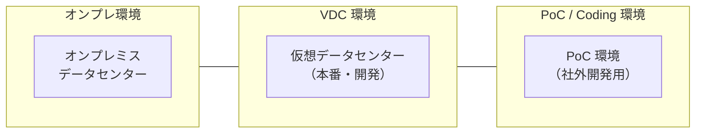
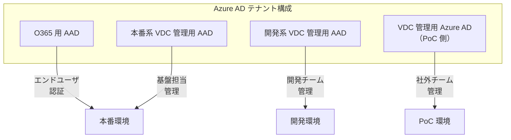
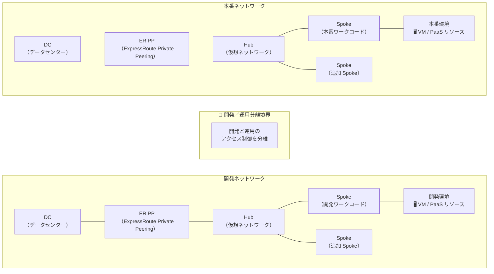
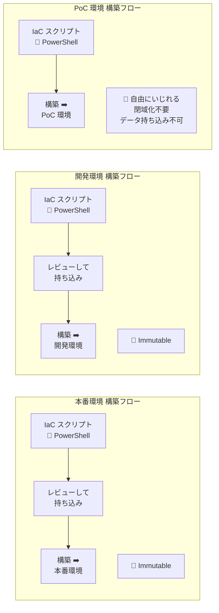
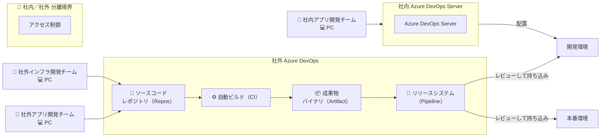
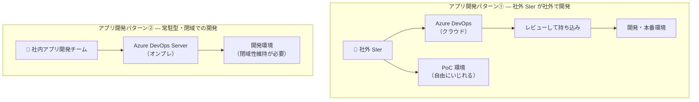
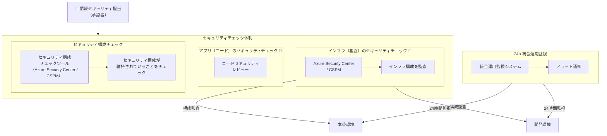
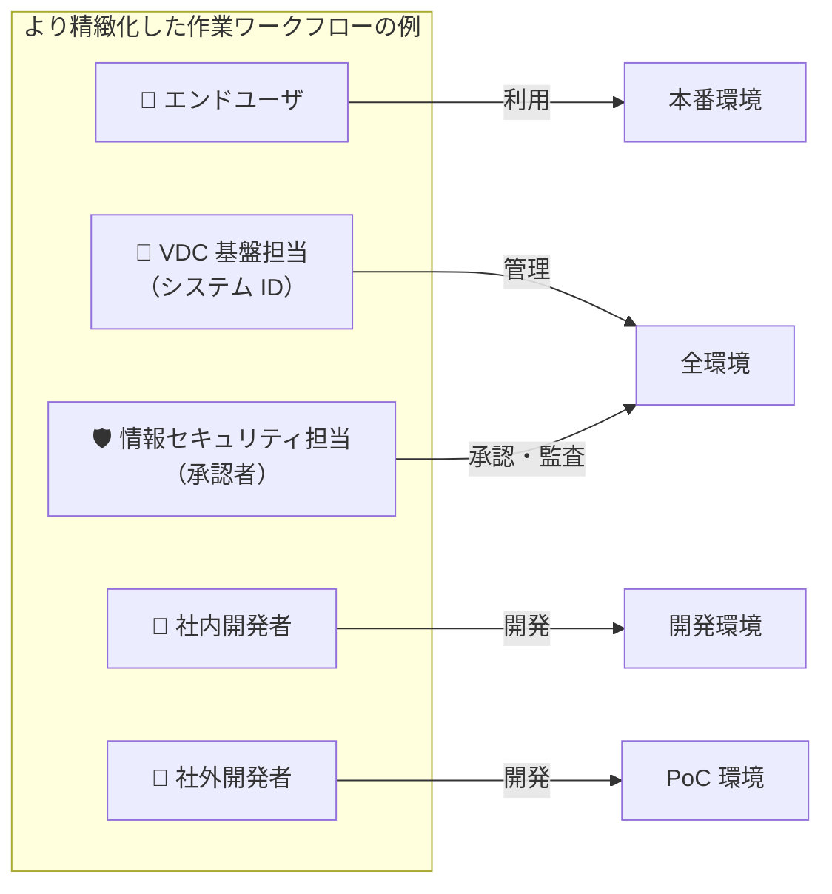
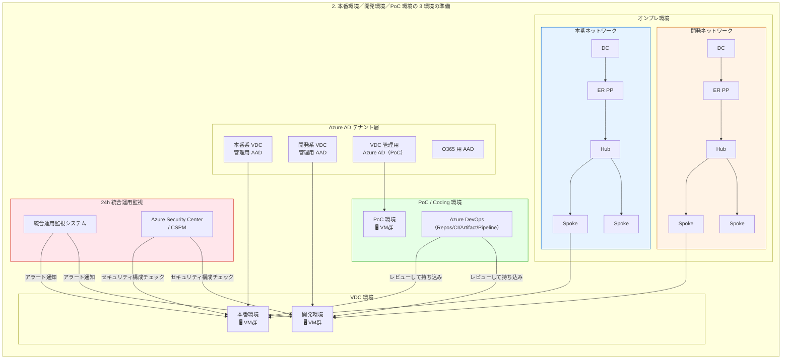

# 2. 本番環境／開発環境／PoC 環境の 3 環境の準備

> **出典:** `抜粋.pptx` スライド 1 — VDC (Virtual Data Center) 環境における 3 環境構成のアーキテクチャ概要図

---

## 全体構成概要

本スライドは、エンタープライズ向け VDC（Virtual Data Center）環境において、**本番環境**・**開発環境**・**PoC 環境** の 3 環境をどのように分離・管理するかを示すアーキテクチャ図です。

### 環境ゾーン区分

スライド上部には 3 つのゾーンが左右に配置されています。

---

## Azure AD テナント構成

各環境は異なる Azure AD テナントに所属し、アイデンティティが分離されています。

---

## ネットワーク構成図

本番ネットワークと開発ネットワークは「**開発／運用分離境界**」で分離され、それぞれに Hub-Spoke トポロジが展開されています。

---

## 環境構築・デプロイフロー

各環境へのデプロイは IaC（Infrastructure as Code）スクリプトによって行われ、Immutable Infrastructure の原則が適用されています。

### 環境ごとのリソース配置フロー

```mermaid
flowchart TD
    subgraph prod_deploy["本番環境への配置"]
        p_worker["👷 社内開発者"]
        p_ps["📜 PowerShell"]
        p_arm["📦 ARM テンプレート"]
        p_deploy["配置 ➡️"]
        p_target["本番 Spoke"]

        p_worker --> p_ps --> p_arm --> p_deploy --> p_target
    end

    subgraph dev_deploy["開発環境への配置"]
        d_worker["👷 社内開発者"]
        d_ps["📜 PowerShell"]
        d_arm["📦 ARM テンプレート"]
        d_deploy1["配置 ➡️"]
        d_deploy2["配置 ➡️"]
        d_target1["開発 Spoke 1"]
        d_target2["開発 Spoke 2"]

        d_worker --> d_ps --> d_arm
        d_arm --> d_deploy1 --> d_target1
        d_arm --> d_deploy2 --> d_target2
    end

    subgraph poc_deploy["PoC 環境への配置"]
        poc_worker["👷 社外開発者"]
        poc_ps["📜 PowerShell"]
        poc_target["PoC Spoke"]

        poc_worker --> poc_ps --> poc_target
    end
```

---

## CI/CD パイプライン構成

社外開発チームは Azure DevOps を活用して開発を行い、社内の Azure DevOps Server とは「**社内／社外分離境界**」で分離されています。

---

## アプリ開発パターン

---

## セキュリティ・監視構成

---

## 利用者・ロール一覧

スライド右上に記載された主要ロール：

---

## 環境比較表

スライド内のテーブルから抽出した環境比較情報：

| 環境分類 | 本番系 | 開発系 | PoC 環境 |
|:---|:---|:---|:---|
| **所属 AAD テナント** | 本番系 VDC 管理用 AAD | 開発系 VDC 管理用 AAD | PoC 管理用 AAD |
| **環境利用者** | エンドユーザ | 社内アプリ開発チーム | 社外インフラ・アプリ開発チーム |
| **環境管理者** | VDC 基盤担当 | VDC 基盤担当 | VDC 基盤担当 |
| **利用目的** | 本番運用 | 社内での開発 | 社外での開発 |
| **本番データ** | 利用可 | 利用可 | 利用不可（ダミー利用） |
| **監査対象** | Yes | Yes | No |

---

## 全体アーキテクチャ（統合図）

---

## 注釈（吹き出し情報）

スライド上の緑色の吹き出し（💚）は以下のポイントを強調しています：

| 対象 | 注釈内容 |
|:---|:---|
| 本番環境 | **Immutable** — 不変インフラストラクチャとして管理 |
| 開発環境 | **Immutable** — 同様に不変インフラストラクチャ |
| 本番環境への持ち込み | **レビューして持ち込み** — 変更は必ずレビューを経由 |
| 開発環境への持ち込み | **レビューして持ち込み** — 同上 |
| PoC 環境 | **自由にいじれる / 閉域化不要 / データ持ち込み不可** |
| 開発環境 | **閉域性維持が必要** |
| インフラ構築 | **IaC スクリプト** による自動構築 |
| Azure DevOps → 本番 | **レビューして持ち込み** |
| セキュリティ構成 | **セキュリティ構成が維持されていることをチェック** |
| セキュリティ監査 | **インフラ構成を監査** |

---

## 分離境界

スライド上のピンク色（🔴）で示された分離境界：

1. **開発／運用分離境界** — 本番ネットワークと開発ネットワークの間に位置し、運用環境と開発環境のアクセスを分離
2. **社内／社外分離境界** — 社内開発チーム（Azure DevOps Server 利用）と社外開発チーム（Azure DevOps クラウド利用）の間に位置

---

## セキュリティチェック体制

上部に2つのセキュリティチェック領域が配置されています：

| カテゴリ | 色 | 内容 |
|:---|:---|:---|
| **インフラ（基盤）のセキュリティチェック** | 🔴 ピンク | Azure Security Center / CSPM による構成監査 |
| **アプリ（コード）のセキュリティチェック** | 🔵 水色 | コードレベルのセキュリティ検証 |
